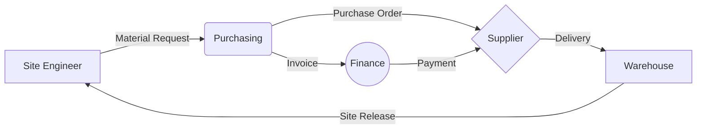

<div align="center">


# 🚀 ProcureFlow
### **The Ultimate Enterprise Procurement & Inventory Intelligence System**

[](https://laravel.com)
[](https://reactjs.org)
[](https://tailwindcss.com)
[](LICENSE)

**ProcureFlow** is a next-generation procurement ecosystem designed to transform how organizations manage materials, vendors, and project financials. Built with a focus on **speed, precision, and enterprise-grade security**, it bridges the gap between site operations and back-office management.

[Explore Features](#-project-highlights) • [Installation](#-quick-start) • [Architecture](#-system-architecture) • [Developer](#-developed-by)

</div>

---

## 💎 Project Highlights

ProcureFlow isn't just a management tool; it's an operational powerhouse.

### 🏗️ Construction-First Intelligence
Specifically engineered for large-scale projects. Track every nut, bolt, and man-hour from the initial **Bill of Quantities (BOQ)** to the final site dispatch.

### 🛒 Dynamic Purchasing Engine
- **Vendor Management**: Maintain a verified list of suppliers with performance tracking.
- **Smart Approvals**: Multi-level, role-based approval workflows for Purchase Requests and Orders.
- **Print-Ready Documents**: Generate professional, formatted PDFs for POs and reports instantly.

### 📦 Precision Inventory
- **GRN Integration**: Automated Goods Receiving Notes linked directly to Purchase Orders.
- **Warehouse to Site**: Seamless dispatch queue with digital confirmation of receipt.
- **Return Logistics**: Handle site-to-warehouse and supplier returns with full traceability.

### 💰 Financial Oversight
- **Real-time Cost Analysis**: Monitor actual vs. budgeted costs at the BOQ component level.
- **Disbursement Control**: Manage petty cash, advances, and liquidations with ease.
- **Audit Trails**: Every action is logged, ensuring 100% accountability.

---

## 🛠️ Modern Tech Stack

| Layer | Technology | Purpose |
| :--- | :--- | :--- |
| **Core** |  | Robust Server-side Logic |
| **Framework** |  | Rapid & Secure API Development |
| **Frontend** |  | Dynamic & Responsive User Interface |
| **Bridge** |  | The Modern Monolith Experience |
| **Styling** |  | Utility-first Design Language |
| **Animations** |  | Premium Micro-interactions |

---

## ⚡ Quick Start

Get ProcureFlow running on your local machine in under 5 minutes.

### 1️⃣ Clone & Enter
```bash
git clone https://github.com/JimBeulah/ProcurementSystem-v2.git
cd ProcurementSystem-v2
```

### 2️⃣ Install Core Dependencies
```bash
composer install
npm install
```

### 3️⃣ Initialize Environment
```bash
cp .env.example .env
php artisan key:generate
```
> [!TIP]
> Update your `DB_*` variables in `.env` before proceeding to the next step.

### 4️⃣ Database & Seeds
```bash
php artisan migrate --seed
```

### 5️⃣ Fire it up!
```bash
composer run dev
```

---

## 📐 System Architecture

### **The "ProcureFlow" Data Flow**


### **Folder Blueprint**
```text
├── app/                  # The Heart (Controllers, Models, Services)
├── database/             # The Memory (Migrations, Seeders)
├── resources/js/         # The Face (React Components, Pages)
│   ├── Components/       # Reusable UI Atoms
│   ├── Layouts/          # Structural Shells
│   └── Pages/            # View Templates
└── routes/               # The Nervous System (Web & API endpoints)
```

---

## 🛡️ Security & Performance

- **Sanctum Authentication**: Secure API and SPA authentication.
- **Spatie RBAC**: Detailed role-level security.
- **Queue Workers**: Heavy tasks (PDF generation, Emails) are handled in the background.
- **Vite Optimization**: Lightning-fast frontend builds.

---

## 👨‍💻 Developed By

<div align="left">

**Nelmarjim Luna**
*Lead Architect & Full Stack Developer*

[](https://linkedin.com/in/nelmarjim-luna)
[](https://github.com/JimBeulah)

</div>

---

<div align="center">
Built with passion for efficient procurement.
</div>
