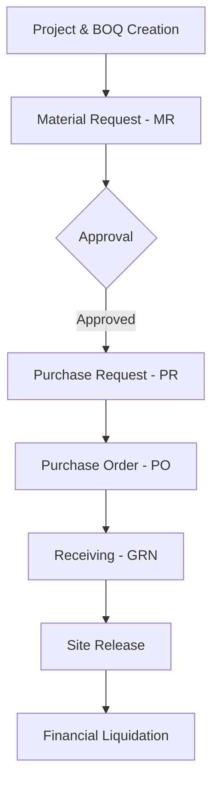

# Procurement System v2 - User Manual

Welcome to the **Procurement System v2**, a comprehensive, macOS-inspired management platform designed to streamline your project's lifecycle—from initial budgeting (BOQ) to final material delivery and financial liquidation.

---

## 🏗️ Table of Contents
1.  [Getting Started](#-getting-started)
2.  [Core Concepts & Workflow](#-core-concepts--workflow)
3.  [Role-Based Guides](#-role-based-guides)
    *   [Site Engineer](#-site-engineer)
    *   [Procurement Officer](#-procurement-officer)
    *   [Warehouse Manager](#-warehouse-manager)
    *   [Finance Officer](#-finance-officer)
    *   [System Administrator](#-system-administrator)
4.  [Module Deep Dives](#-module-deep-dives)
    *   [Project & BOQ Management](#project--boq-management)
    *   [Purchasing (MR/PR/PO)](#purchasing-mrprpo)
    *   [Inventory & Logistics](#inventory--logistics)
    *   [Financial Tracking](#financial-tracking)
5.  [FAQ & Troubleshooting](#-faq--troubleshooting)

---

## 🚀 Getting Started

### Accessing the System
1.  Navigate to the application URL in your web browser.
2.  Log in using your **Username** and **Password**.
3.  **First-time Login**: If it's your first time logging in, you may be prompted to change your temporary password for security.

### Dashboard Overview
The **Dashboard** is your command center. It provides:
-   **Stat Cards**: Real-time counts of Pending Approvals, Active Projects, Total Orders, and System Alerts.
-   **Recent Activities**: A live feed of the latest actions taken within the system (e.g., "New PO Created").
-   **Budget Utilization**: Visual progress bars showing how much of a project's budget has been consumed.
-   **Pro-Tips**: Dynamic alerts to help you manage your projects more effectively.

---

## 🔄 Core Concepts & Workflow

The system operates on a **Strict Budget Control** model. No materials can be requested unless they exist in the **Bill of Quantities (BOQ)** and are within the allocated budget limits.

### The Procurement Lifecycle

---

## 👤 Role-Based Guides

### 👷 Site Engineer
Your primary goal is to ensure the project has the materials it needs while staying within the BOQ.
-   **Creating Material Requests (MR)**: Navigate to your Project -> Material Requests. Select items from the BOQ, specify quantities, and submit for approval.
-   **Receiving Deliveries**: When a supplier delivers items to the site, log a **Goods Receipt Note (GRN)** to update the inventory.
-   **Confirming Site Releases**: When materials are dispatched from the central warehouse, you must confirm receipt via the **Site Release** module.

### 📦 Procurement Officer
You manage the external purchasing process.
-   **Supplier Management**: Maintain an up-to-date database of verified suppliers.
-   **Purchase Orders (PO)**: Convert approved Material Requests into Purchase Orders. Ensure items are grouped correctly by supplier.
-   **Printing POs**: Use the **Print PO** feature to generate professional PDF documents for your vendors.

### 🏭 Warehouse Manager
You are responsible for the physical logistics of materials.
-   **Inventory Management**: Monitor stock levels across all projects.
-   **Site Releases (Dispatch)**: Use the **Dispatch Queue** to release items from the warehouse to specific project sites.
-   **Material Returns**: Handle returns from project sites for defective or excess materials.

### 💰 Finance Officer
You oversee the financial health of all projects.
-   **Invoices & Disbursements**: Log supplier invoices against Purchase Orders and process payments.
-   **Liquidate**: "Liquidate" disbursements once they are finalized to reflect actual spending against the budget.
-   **Financial Reporting**: Generate high-level reports to track Budget vs. Actual spending per project.

### ⚙️ System Administrator
You maintain the system's integrity and user access.
-   **User Management**: Create new user accounts and assign roles (Site Engineer, Finance, etc.).
-   **Workflows**: Configure multi-stage approval levels for POs and BOQs.
-   **Auditing**: Access **Activity Logs** to track every critical action taken by users.

---

## 📑 Module Deep Dives

### Project & BOQ Management
The BOQ is the heart of the system.
-   **Elements & Items**: Organize your budget into logical groups (e.g., "Foundation", "Electrical").
-   **Resources**: Every BOQ item is composed of **Material, Labor, and Equipment** components.
-   **Bulk Imports**: Use the **Bulk Upload** feature for fast data entry from Excel.

### Inventory & Logistics
-   **GRN (Goods Receipt Note)**: Crucial for tracking what was actually delivered vs. what was ordered.
-   **Site Dispatch**: Tracks the physical movement of materials. Includes tracking of vehicle numbers and dispatch times.

---

## ❓ FAQ & Troubleshooting

### **"Why can't I submit a Material Request?"**
Ensure the requested quantity does not exceed the remaining balance in the BOQ for that item. The system prevents over-budgeting by default.

### **"The UI looks broken or isn't updating."**
Try clearing your browser cache or performing a "Hard Refresh" (Ctrl+F5). Ensure you have a stable internet connection for the glassmorphism animations to load smoothly.

### **"I lost my password."**
Contact your System Administrator to trigger a password reset through the **Settings -> Users** module.

---

*This manual was automatically generated and is updated periodically to reflect system changes.*
