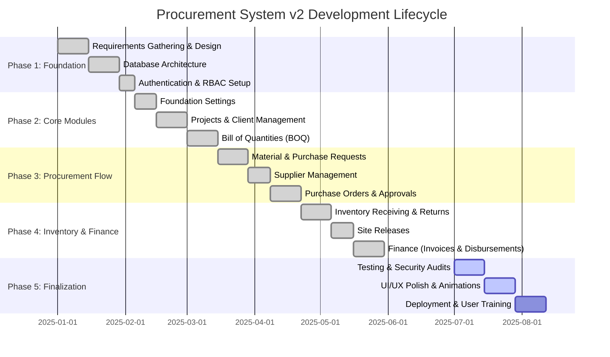

# Procurement System v2 - Project Plan & Gantt Chart

This document outlines the high-level project plan and timeline for the development of Procurement System v2.

## Project Phases

### Phase 1: Foundation & Setup
- System requirements and database schema design.
- Setup of Laravel backend and React/Inertia frontend.
- Implementation of Authentication and Role-Based Access Control (RBAC).

### Phase 2: Core Project Modules
- **Foundation Settings**: System configuration and User management.
- **Client & Project Management**: Creating projects and assigning them to clients.
- **Bill of Quantities (BOQ)**: Granular itemized budgeting for projects (labor, materials, equipment).

### Phase 3: Procurement Workflows
- **Material Requests**: Requesting items required for a project.
- **Purchase Requests (PR)**: Internal requests to buy materials.
- **Suppliers**: Manage supplier contacts and details.
- **Purchase Orders (PO)**: Officially ordering materials with multi-level approval workflows.

### Phase 4: Inventory & Finance
- **Inventory Receiving**: Goods Receipt Notes (GRN) upon delivery.
- **Material Returns**: Handling defective or excess items.
- **Site Releases**: Moving inventory to active project sites.
- **Finance**: Invoicing, Disbursements, and Financial Reporting.

### Phase 5: Polish & Deployment
- Security Audits (Authorization Policies).
- UI/UX Refinements (Animations, Responsive Design).
- Final Deployment and documentation.

## Gantt Chart

